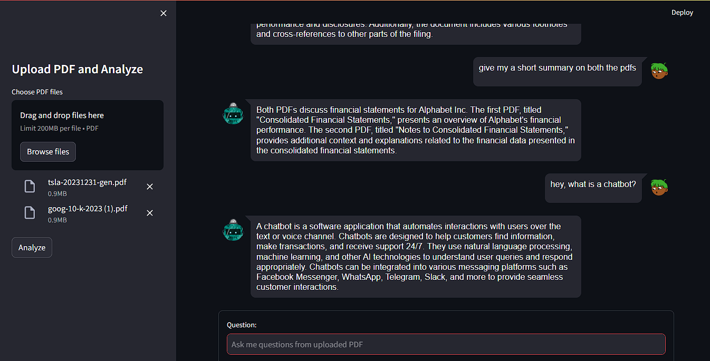

<div align="center">
    <h1>PDF Analyzer Bot 🤖</h1>
</div>

Welcome to the **PDF Analyzer Bot** project! This bot is designed to provide answers to questions extracted from uploaded PDF files using a conversational interface. It leverages a large language model and a FAISS vector store to deliver accurate and efficient responses. Let's dive into the details!

## Folder Structure

Here's an overview of the project's folder structure:

```plaintext
PDF Analyzer Bot/
├── app.py
├── utils.py
├── fssasis_index/
├── artifacts/
│   └── mistral-7b-instruct-v0.2.Q2_K.gguf
├── requirements.txt
├── content_engine.md
```

- **app.py**: The main application file that sets up the Streamlit interface and handles user interactions.
- **utils.py**: Contains utility functions for creating the language model and FAISS vector store.
- **fssasis_index/**: Directory where the FAISS index is stored.
- **artifacts/**: Directory containing the Mistral 7B model.
- **requirements.txt**: Lists all the required Python packages for the project.

## Features

- **Upload PDFs**: Users can upload multiple PDF files for analysis.
- **Conversational Interface**: Ask questions about the content of the PDFs and get answers in a chat format.
- **Persistent Vector Store**: The FAISS vector store is saved locally, so it doesn't need to be recreated every time the application runs.
- **Efficient Text Processing**: Uses advanced text splitting and embedding techniques for accurate document retrieval.

## Getting Started

Follow these steps to set up and run the project on your local machine:

### Prerequisites

- Python 3.8 or higher
- Pip (Python package installer)

### Installation

1. **Clone the Repository**:
    ```bash
    git clone <repository_url>
    cd <name of repo>
    ```

2. **Install Dependencies**:
    ```bash
    pip install -r requirements.txt
    ```

3. **Prepare the Artifacts**:
    - Ensure the Mistral 7B model file (`mistral-7b-instruct-v0.2.Q2_K.gguf`) is in the `artifacts/` directory.

### Running the Application

1. **Run the Streamlit App**:
    ```bash
    streamlit run app.py
    ```

2. **Upload PDF Files**:
    - Use the sidebar to upload one or more PDF files.
    - Click the "Analyze" button to start the analysis.

3. **Ask Questions**:
    - Interact with the bot by asking questions related to the uploaded PDFs.
    - Enjoy the seamless and engaging chat experience!

## Screenshot

Here's a sample screenshot of the chat interface:



## Code Overview

### app.py

This file contains the main Streamlit application logic, including:

- **Session State Initialization**: Initializes session states for conversation history and vector store.
- **Conversational Chain Creation**: Sets up the conversational retrieval chain using the language model and vector store.
- **User Interface**: Handles user interactions and displays chat messages.

### utils.py

This file includes utility functions for:

- **Language Model Creation**: Initializes the Mistral 7B language model using LlamaCpp.
- **Vector Store Creation**: Processes PDF files, splits text into chunks, creates embeddings, and stores them in a FAISS vector store.
- **Vector Store Loading**: Loads the FAISS vector store from a local file if it exists.

## Contributing

We welcome contributions to enhance the PDF Analyzer Bot. If you have any ideas or improvements, feel free to submit a pull request or open an issue.

## License

This project is licensed under the MIT License.

## Acknowledgements

- **LangChain Community**: For the amazing tools and libraries.
- **[HuggingFace](https://huggingface.co/mahiatlinux/Mistral-7B-Instruct-v0.2-Q2_K-GGUF)**: For the embeddings model.
- **Streamlit**: For the easy-to-use web app framework.

---

Dive into the code, upload your PDFs, and start chatting with the bot. Enjoy analyzing your documents with ease and efficiency! 🚀

Feel free to reach out if you have any questions or need further assistance.
